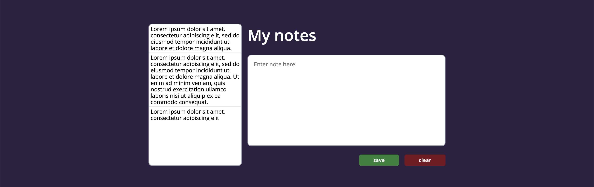

# Notatnik

Zapraszam do mojej strony notatnika: [aplikacja notatnik](https://bartnie.github.io/notes-JS/)

## Jak uruchomić stronę lokalnie

Aby uruchomić stronę notatnika lokalnie, wykonaj polecenia:

`npm install -g gulp-cli`

`npm install`

`gulp`
